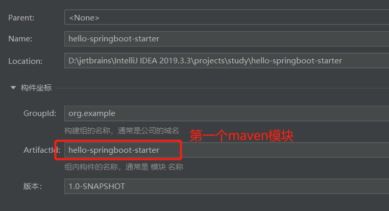
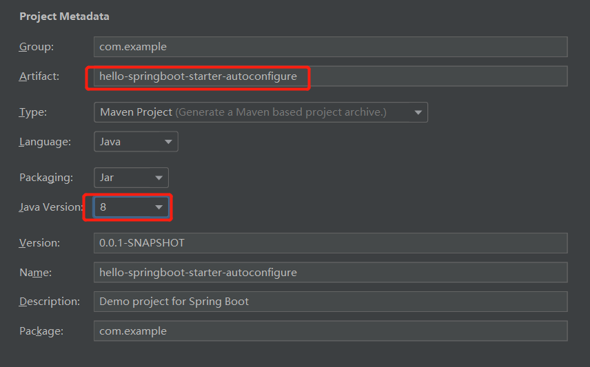
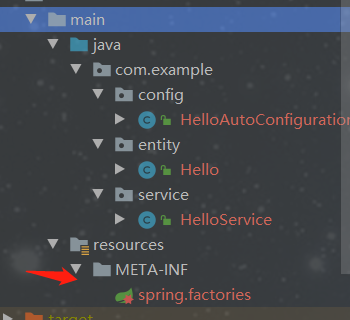
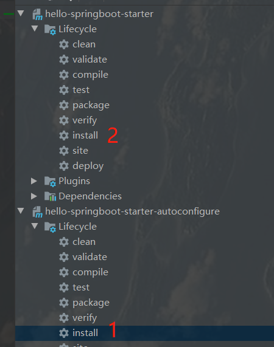
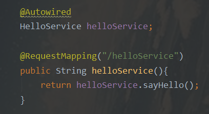
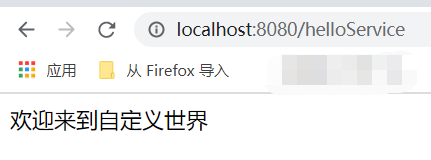
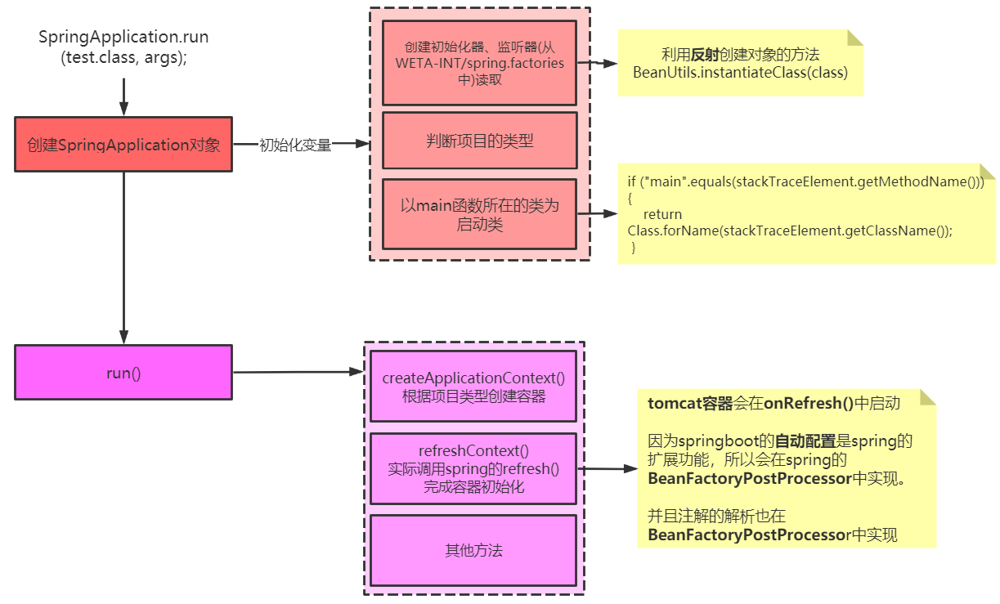

SpringBoot面试
===

starter
---

starter相当于一个**jar包**，需要使用时直接在maven中引入该starter坐标即可，**starter里面设置了一些默认的配置信息**，springboot启动时会自动的将该配置类中注册的bean放到IOC容器中，并且如果我们需要修改配置文件的内容可以在springboot的配置文件中进行修改。

如果一个自定义配置类经常需要在别的项目中使用，那么可以将该自定义配置类封装成一个starter，然后其他项目中使用的话直接引入坐标即可，这样可以很好的提高复用性。

> starter等价于 jar包 + 配置文件 + 自动注册bean

官方所有的starter的命名都遵从`spring-boot-starter-*`，如果自定义starter建议使用`自定义名称-spring-boot-starter` 。


自定义starter
---

除了一些官方提供的starter，我们也可以自定义starter来封装一些需要经常**复用的自定义的配置类**。

自定义starter有几个步骤：

1. 创建一个空项目，里面创建两个模块；其中一个作为**启动器**，只负责引入自定义starter；另一个负责设置自动配置的信息，引入需要的依赖等操作。
2. 在第一个模块中引入第二个模块的依赖。
3. 在第二个模块中：
   1. 引入自动配置依赖
   2. 定义实体类，用于映射配置信息（跟用户交互），提供setter和getter方法
   3. 定义service类 操作实体类。
   4. 定义一个 配置类，用于注册bean对象（实体类以及service）
   5. 在`META-INF/spring.factories` 下指定 配置类 的路径

> 其实第二个模块才是真正的自定义starter，第一个模块只是负责引入自定义starter，方便管理

***

第一步：创建一个空项目，在里面创建一个maven项目跟springboot项目





第二步：在第一个项目（作为启动器）中引入第二个springboot项目（自动配置项目）

```xml
<dependencies>
    <dependency>
        <groupId>com.example</groupId>
        <artifactId>hello-springboot-starter-autoconfigure</artifactId>
        <version>0.0.1-SNAPSHOT</version>
    </dependency>
</dependencies>
```

第三步：在自动配置项目中清除不需要用到的文件（如主类、配置文件、依赖等）

3.1 引入自动配置依赖

```xml
<dependency>
    <groupId>org.springframework.boot</groupId>
    <artifactId>spring-boot-configuration-processor</artifactId>
    <optional>true</optional>
</dependency>
```

3.2 定义实体类，用于映射配置信息，提供setter和getter方法

```java
package com.example.entity;

import org.springframework.boot.context.properties.ConfigurationProperties;

@ConfigurationProperties(prefix = "hello")
public class Hello {
    private String welcome;
    private String address;

    // setter跟getter
}
```

3.3 定义service类 操作实体类

```java
package com.example.service;

import com.example.entity.Hello;
import org.springframework.beans.factory.annotation.Autowired;

public class HelloService {

    @Autowired
    Hello hello;

    public String sayHello(){
        return hello.getWelcome() + "来到" + hello.getAddress();
    }
}
```

3.4 定义一个 配置类，用于注册bean对象（实体类以及service）

```java
package com.example.config;

import com.example.entity.Hello;
import com.example.service.HelloService;
import org.springframework.boot.autoconfigure.condition.ConditionalOnMissingBean;
import org.springframework.boot.context.properties.EnableConfigurationProperties;
import org.springframework.context.annotation.Bean;
import org.springframework.context.annotation.Configuration;

@Configuration // 表示这是一个配置类
@ConditionalOnMissingBean(HelloService.class) // 如果HelloService不存在才这个配置类才生效
@EnableConfigurationProperties(Hello.class) // 注册Hello
public class HelloAutoConfiguration {

    @Bean
    public HelloService helloService(){
        return new HelloService();
    }
}
```

> 如果需要条件判断，满足条件时才加载该配置类，可以使用`@Conditional` 注解。

3.5 在resources目录下 创建 `META-INF/spring.factories` 文件，指定配置类的路径，key是固定的，value为配置类的路径



```java
org.springframework.boot.autoconfigure.EnableAutoConfiguration=\
com.example.config.HelloAutoConfiguration
```

至此，自定义starter已经完成了，接下来需要先把这两个通过maven `install` 到本地仓库。注意：**要先install自动配置项目，再install启动器项目**。



然后在项目中引入 **启动器的依赖** ，在springbot的配置文件中修改属性即可。


创建controller：






springboot启动流程
---




自动配置流程
---

springboot会基于你添加的jar包依赖，尝试自动配置你的spring项目。

springboot会加载`@EnableAutoConfiguration` 下的配置，而此注解import了选择器类`AutoConfigurationImportSelector` ，这个选择器会扫描所有在 `META-INF 下的 spring.factorites` ，所有的自动配置类都在这里，只有符合`@ConditionalOnXxx` 条件的才会被加载，形成beandefinition，然后被创建放入到IOC容器中，形成一个个的bean对象。

> 因为springboot的自动配置是spring的扩展功能，所以会在spring的BeanFactoryPostProcessor中实现。
>
> springboot会将所有用到的自动配置类输出到一个总的配置文件中。


配置文件位置
---

springboot启动时会扫描以下位置（**优先级由高到低**）的`application.properties`或者`application.yml`文件作为springboot的默认配置文件。

1. 项目**根目录**下的**config目录**（如果有父工程则要放在父工程的根目录下）
2. 项目**根目录**（如果有父工程则要放在父工程的根目录下）
3. **resources目录**下的**config目录** 
4. **resources目录** 

springboot会从这四个位置加载配置文件。这四个位置的配置文件会进行互补配置，若出现相同的配置 高优先级 会覆盖 低优先级。