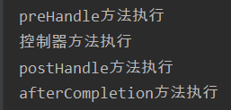
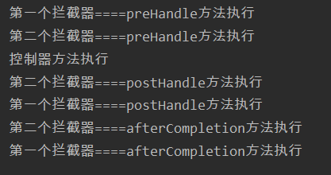
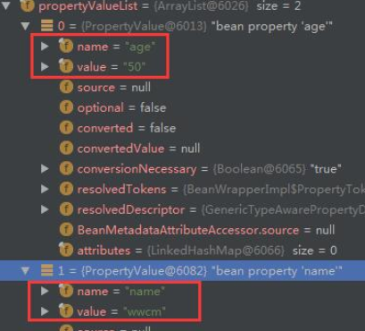

Spring MVC面试
===

执行流程
---

SpringMVC执行流程示意图：


流程分析：

1. 浏览器提交请求到中央调度器。

2. 中央调度器直接将请求转给**处理器映射器HandleMapping**。

   - handler等价于controller，封装了方法的定义信息，如方法名、参数类型、返回类型等信息

3. 处理器映射器通过`map.get(URI)`的方式得到处理该请求的处理器handler，并将其跟拦截器一起封装成**处理器执行链HandlerExecutionChain** 并返回给中央调度器。

   - 处理器执行链 中保存着`处理器对象`跟`针对该对象的拦截器`。

4. 中央调度器根据处理器执行链中的处理器，找到能够执行该处理器的**处理器适配器HandleAdaptor**。

   - 因为controller的实现有三种，所以要使用适配器来执行

5. 处理器适配器调用处理器，执行controller中的某个方法。

6. 处理器将处理结果及要跳转的视图封装到一个对象**ModelAndView**中，并将其返回给适配器

7. 适配器将结果返回给调度器。

8. 调度器调用**视图解析器**，将ModelAndView中的视图名封装成视图对象**View**。

   View是一个接口，在框架中，是用View跟其实现类来表示视图的。

   `mv.setViewName("show");` 等价于 `mv.setView(new InternalResourceView("/WEB-INF/view/show.jsp"));` 

9. 视图解析器将封装好的**视图对象View**返回给调度器。

10. 调度器调用视图对象，让其自己进行渲染，即进行数据填充，形成响应对象。

11. 调度器响应浏览器


求参数的方式
---

携带请求参数的方式有两种：一种是从url路径参数中获取，一种是从请求body中获取。

### 获取url路径参数

`@RequestParam`和`@PathVariable` 都可以获取路径参数，前者是**获取问号？后面的参数**，后者是**获取问号？前面的组成路径的参数**。

例如：`localhost:8080/springmvc/111?param1=10&param2=20` 

**@RequestParam**获取的是**param1**和**param2**。

**@PathVariable**获取的是**111** 

```java
@RequestMapping("/springmvc/{id}")
public String getDetails(
    @PathVariable(value="id") 	   String  id,
    @RequestParam(value="param1")  String  param1,
    @RequestParam(value="param2")  String  param2)
{
	....逻辑代码	
}
```

**tips**：value属性可以省略，默认为形参名。


拦截器
---

拦截器跟过滤器类似，可以拦截用户的请求，做请求判断处理，比如用户登录处理，权限检查，日志记录等。拦截器是全局的，可以对多个controller进行拦截。

在springMVC中，拦截器需要实现`HandlerInterceptor`接口。该接口有三个方法，这三个方法的执行时间分别是**请求处理之前（controller方法执行之前）**、**控制器方法执行之后**、**请求处理完成**。

在框架中实现拦截器的步骤：

1. 创建类实现`HandlerInterceptor`接口，并实现接口中三个方法的任意个方法
2. 配置文件中指定拦截器的URI地址.


`HandlerInterceptor`接口的源码：

```java
package org.springframework.web.servlet;

import javax.servlet.http.HttpServletRequest;
import javax.servlet.http.HttpServletResponse;
import org.springframework.lang.Nullable;

public interface HandlerInterceptor {
    default boolean preHandle(HttpServletRequest request, HttpServletResponse response, Object handler) throws Exception {
        return true;
    }

    default void postHandle(HttpServletRequest request, HttpServletResponse response, Object handler, @Nullable ModelAndView modelAndView) throws Exception {
    }

    default void afterCompletion(HttpServletRequest request, HttpServletResponse response, Object handler, @Nullable Exception ex) throws Exception {
    }
}
```

**preHandle** 为预处理方法，即在请求之前进行拦截。在此方法中可以进行登录及权限验证。

参数`Object handler` 为被拦截的控制器对象。

返回值`boolean` 为true时拦截器才会放行该请求，否则请求中断。


**postHandle** 为后处理方法，即在控制器方法执行之后拦截。该方法中可以修改控制器中的ModelAndView。

参数`Object handler` 为被拦截的控制器对象；`ModelAndView modelAndView`为控制器方法的返回值。


**afterCompletion** 是请求处理完成之后执行的方法，即渲染完成后，一般做资源回收工作的。

参数`Object handler` 为被拦截的控制器对象；`Exception ex` 为程序中的异常对象。

***

配置文件中声明拦截器方式：

```xml
<!--  声明拦截器  -->
<mvc:interceptors>
    <!--  声明第一个拦截器  -->
    <mvc:interceptor>
        <!--  指定第一个拦截器要拦截的uri地址
              **为通配符，表示任意的字符、文件或多级目录
        -->
        <mvc:mapping path="/user/**"/>
        <!--  拦截器对象  -->
        <bean class="Interceptor.MyInterceptor"/>
    </mvc:interceptor>
</mvc:interceptors>
```

假设给拦截器的三个方法跟控制器方法都加了输出语句，下面来看看他们四个的先后输出顺序：



假设有两个拦截器同时对一个uri进行拦截呢，会发生什么？（**preHandle都返回true**）



其流程如下图所示：


假设有两个拦截器同时对一个uri进行拦截呢，会发生什么？（**第一个拦截器的preHandle都返回true，第二个返回false**）


假设有两个拦截器同时对一个uri进行拦截呢，会发生什么？（**第一个拦截器的preHandle都返回false，第二个返回true**）


拦截器与过滤器的区别
---

> 这两个使用的设计模式都是 **责任链模式**。

1. 过滤器实现Filter接口，拦截器实现HandlerInterceptor接口。
2. 过滤器侧重于数据过滤。拦截器用来验证请求的。
3. 过滤器在拦截器之前执行。
4. 过滤器是tomcat创建的对象，拦截器是框架创建的对象。


controller的类型
---

controller的类型有两种：<u>Controller类型</u> 跟 <u>BeanName类型</u>。

- 使用**@Controller**注解的类是Controller类型；
- 实现**Controller接口**或**HttpRequestHandler接口**的类为BeanName类型


参数绑定过程
---

方法参数解析器实现了 HandlerMethodArgumentResolver接口，主要方法如下：

```java
public interface HandlerMethodArgumentResolver {

    // 该解析器是否支持parameter参数的解析
    boolean supportsParameter(MethodParameter parameter);

    // 将方法参数从给定请求(webRequest)解析为参数值并返回
    Object resolveArgument(MethodParameter parameter,
                          ModelAndViewContainer mavContainer,
                          NativeWebRequest webRequest,
                          WebDataBinderFactory binderFactory) throws Exception;
}
```


### 简单类型参数绑定

首先，参数绑定发生在方法执行之前，由方法参数解析器去解析请求中的参数。

```java
// 从request中解析出HandlerMethod方法所需要的参数，并返回Object[]
Object[] args = getMethodArgumentValues(request, mavContainer, providedArgs);
// 通过反射执行HandleMethod中的method，方法参数为args，并返回方法执行的返回值
Object returnValue = invoke(args);
```

解析请求参数之前，需要先获取方法参数，得到一个方法参数数组（MethodParameter[]），接着遍历这个数组，找到合适的**方法参数解析器**解析每个元素。

如果是简单类型参数，则会把 MethodParameter 的类型和名称封装到 NameValueInfo 对象中，然后将其放到缓存中下次可以直接获取。

接着根据NameValueInfo对象中指定的参数名，使用 `request.getParameterValues(name);` 方法获取对应同名的请求参数，并根据NameValueInfo对象中指定的类型进行类型转换。

最后，通过反射执行HandleMethod中的method，方法参数为args。


### 对象参数绑定

> 对象参数的解析由 ModelAttributeMethodProcessor 完成。

首先利用反射创建方法参数类型的对象，根据reqeust中的参数创建一个propertyValueList ，里面存放了一个或多个PropertyValue，每个PropertyValue 包含属性名跟属性值。



然后遍历propertyValueList，根据每个元素的name 使用setter方法给对象同名属性赋值。


