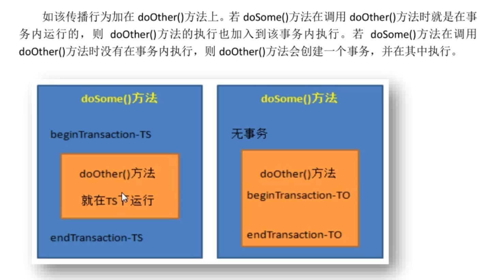

Spring面试
===

什么是Spring？
---

spring本身是一个框架，同时也提供了对其他框架的整合方案。有着ioc容器的作用，用来装载整体的bean对象，它帮我们管理着bean对象从创建、初始化到销毁的整个生命周期。另外spring也提供了AOP的支持，分离了主业务代码跟交叉业务代码，很大程度上的降低了代码耦合度。


IOC的加载过程
---

IOC（Inversion of Control）：控制反转，是一个思想，将对象的创建、初始化和销毁等操作都交给代码外的容器实现，让容器帮我们管理bean对象整个生命周期，而不需要程序员自己手动的管理。DI依赖注入就是IOC的具体实现。


1. 首先，通过**BeanDefinitionReader** 读取指定的配置文件生成bean的定义信息（BeanDefinition）放到BeanDefinitionMap中，当所有的bean定义信息都生成之后==完成BeanFactory的创建==。BeanFactory是容器的入口，等同于容器。
2. 通过**BeanFactoryPostProcessor**接口的实现类 可以动态的修改BeanDefinition的内容，比如数据库配置文件的占位符`${jdbc.url}` 、`类上注解`的解析。经过这一步骤之后才形成了**完整BeanDefinition**
3. 创建bean对象，初始化等操作，此时==完成BeanFactory的初始化==。

对应的源码方法示意图如下：（死亡**十二**方法）


默认加载配置文件的路径：

```java
protected String[] getDefaultConfigLocations() {
    return this.getNamespace() != null ? new String[]{"/WEB-INF/" + this.getNamespace() + ".xml"} : new String[]{"/WEB-INF/applicationContext.xml"};
}
```


Spring bean的生命周期
---

> bean的创建操作是在createBean()方法中创建

1. 利用反射创建对象

2. 调用populateBean方法，根据xml文件或注解（@Autowired）对属性进行赋值

   - 此时除了容器对象属性，其他属性都完成赋值（bean中可能包含容器对象属性）

3. 根据实现的aware接口调用相关的aware方法，**对应的容器对象属性完成赋值** 

   - ==aware接口是为了使某些自定义对象可以方便的获取到容器对象==。 比如BeanNameAware、BeanFactoryAware、ApplicationContextAware接口，可以根据这些接口进行扩展

4. 调用BeanPostProcessor的BeforeInitial方法

5. 调用init方法

6. 调用BeanPostProcessor的AfterInitial方法，**AOP代理对象**在此生成。

7. 此时拥有完整对象，可以使用

8. 销毁对象

> BeanFactoryPostProcessor：是一个接口，针对整个工厂生产出来的BeanDefinition作出修改或者注册。比如ConfigurationClassPostProcessor处理类上的注解，PropertyPlaceholderConfigurer处理配置文件的占位符。
>
> BeanPostProcessor：是一个接口，可用于bean对象初始化前后进行逻辑增强。


BeanFactory和FactoryBean区别
---

BeanFactory：是IOC容器的核心接口，在它的实现类中装载着整体的bean对象，具有完整的固定的创建bean的流程。

FactoryBean: 是一个bean对象，它可以生产或者修饰bean对象，方式不固定，可自定义。例如给对象创建代理对象。


@bean跟@component的区别
---

@bean跟@component一样都可以注册bean到Spring容器中。

但他们有以下区别：

1. 作用对象不同: @Component 注解作用于**类**，而@Bean注解作用于**方法**。
2. `@Component`通常是通过**类路径扫描**自动注册到Spring容器中。`@Bean` 注解通常是在**方法中定义**产生这个 bean，@Bean告诉Spring这个方法将会返回一个对象，这个对象要注册为Spring应用上下文中的bean。
3. @Bean 注解比 @Component 注解的自定义性更强，而且很多地方我们只能通过 @Bean 注解来注册bean。比如当我们引用第三方库中的类需要装配到 Spring容器时，则只能通过 @Bean来实现

```java
@Configuration
public class WebSocketConfig {
    @Bean
    public Student student(){
        return new Student();
   }
    // 等价于
    @Autowired
    Student student;
}
```


对AOP的理解
---

aop称为面向切面编程，可以将交叉业务代码跟主业务代码分离开，降低代码耦合。因为aop其实是ioc的一个扩展功能，所以会在**BeanPostProcessor的after**方法中实现。其实现的原理是**动态代理**：JDK或cjlib方式，如果代理的对象实现了某个接口则会优先使用jdk方式创建，否则使用cjlib生成一个子类作为代理。

面向切面编程：

1. 要以**切面**为核心，分析项目中哪些功能可以用切面的形式去实现它
2. 要合理的安排切面执行的**时间Advice**（在目标方法的前还是后）以及切面执行的**位置Pointcut**（在哪个类哪个方法中）

在一个方法只被**一个**aspect类拦截时，aspect类内部的 advice 将按照以下的顺序进行执行：


在一个方法被**多个**aspect类拦截时，aspect类内部的 advice 将按照以下的顺序进行执行：


AOP的实现
---

1. 创建代理对象。
2. spring会将 目标方法 中所有的通知经过拓扑排序后加入到chain对象（拦截器链）中，chain对象是一个List，第一个元素固定是**ExposeInvocationInterceptor**，第二个元素开始才是通知对象。
3. 如果chain对象为null，则直接利用反射执行目标方法。
4. 否则将chain对象加入到代理对象中，由代理对象递归调用执行链上的通知。只有递归完所有的通知（计数判断）才利用反射执行目标方法，接着逐层递归回去执行切面。

> 综上：before会在链表的最末端，因为要最先执行。


AOP为什么不能拦截内部方法
---

何为内部方法？

```java
public class SomeServiceImpl implements SomeService {

    @Override
    public void doSome() {
        System.out.println("喝奶茶了!");
        // 调用内部方法
        doInnerMethod();
    }

    @Override
    public void doInnerMethod(){
        System.out.println("内部方法不会被拦截");
    }
}
```

在上面代码中，如果只执行doSome，则只有doSome方法会被拦截，而doInnerMethod只是普通的调用。

原因：

代理对象只是负责增加逻辑，以及调用原始方法，当代理对象执行完逻辑调用目标方法时，实际还是原始对象调用目标方法，即doSome，所以doInnerMethod也是由原始对象调用，而不会被拦截器调用。


Spring bean的作用域
---

`<bean id="" class="" scope="singleton" />` 设置作用域

1. singleton：默认使用的作用域。每个容器中只有一个bean的实例，单例的模式由BeanFactory自身来维护。
2. prototype：为每一次getBean()提供一个实例。
3. request：为每一个网络请求创建一个实例，在请求完成以后，bean会失效并被垃圾回收器回收。
4. session：与request范围类似，确保每个session中有一个bean的实例，在session过期后，bean会随之失效。
5. global-session：全局作用域，与session大体相同，但仅在**portlet**应用中使用


BeanFactory和ApplicationContext的区别
---

**ApplicationContext是BeanFactory的子接口**，对其进行了许多扩展。

区别：

1. **BeanFactory**通过**懒加载**的方式注入bean，**ApplicationContext**是在容器启动时就**加载了全部**的bean，所以可以在容器启动时就发现存在的配置问题。
2. BeanFactory 和 ApplicationContext都支持 BeanPostProcessor、BeanFactoryPostProcessor的使用，但两者之间的区别是：BeanFactory需要**手动注册**，而Applicationcontext则是**自动注册**。

ApplicationContext扩展的功能：

1. 继承MessageSource，支持国际化
2. 统一的资源文件访问方式
3. 同时加载多个配置文件


事务传播行为
---

**PROPAGATION_REQUIRED**：指定的方法必须在事务内执行。若当前存在事务，则加入到当前事务中；否则创建一个新事物。（spring默认的传播行为）



**PROPAGATION_REQUIRED_NEW**：总是创建一个事务。若当前存在事务，则将当前事务挂起，重新创建一个新事务，新事务执行完毕才将原事务唤醒。

​	如上述的doSome()跟doOther()；若doSome()的执行有事务，则doOther()会创建一个新事务并将doSome()的事务挂起，直至新事务执行完毕。

**PROPAGATION_SUPPORTS**：指定的方法支持当前事务，但若当前没有事务，则以非事务的方式执行。如doSome()的执行有事务，则doOther()会加入到当前事务；若doSome()的执行没有事务，则doOther()就以非事务的方式执行。

PROPAGATION_NESTED：如果当前存在事务，则在嵌套事务内执行。==当前事务为父事务，本身作为子事务==。父事务回滚子事务一定回滚，子事务回滚父事务不一定回滚。如果当前没有事务，就新建一个事务。

PROPAGATION_NOT_SUPPORTED：以非事务方式执行操作，如果当前存在事务，就把当前事务挂起。

PROPAGATION_MANDATORY：如果当前存在事务，就加入该事务，如果当前不存在事务，就抛出异常。

PROPAGATION_NEVER：以非事务方式执行，如果当前存在事务，则抛出异常。


事务失效场景
---

1. 数据库引擎不支持事务
2. 注解所在的方法不是public修饰
3. 注解所在的类没有被加载成bean
4. 异常被catch掉
5. 传播行为没有设置正确


Spring事务是如何实现的
---

spring事务是基于数据库事务和AOP机制的

1. spring首先会对使用了@Transational 注解的类生成一个代理对象
2. 当代理对象调用方法的时候，会判断该方法上是否加了@Transational注解。
3. 如果加了则利用**事务管理器对象**去连接数据库，然后根据指定的事务传播行为进行相关的操作，比如关闭自动提交，接着执行目标方法，如果没有出现异常则进行提交（afterReturning），否则进行回滚（afterThrowing）。

> 为了保证**事务同步**，将获取连接的操作交给spring，让其去数据库连接池中获取连接，这也是为什么要在spring配置文件中配置连接池的原因。而mybatis需要用到连接时去spring获取即可。
>
> 一个线程一个连接，spring中使用ThreadLocal来保证每个连接的线程安全。


循环依赖
---

循环依赖：两个或多个对象实例之间构成一个环形调用。比如A依赖B，B依赖A。

```java
@Service
public class TestService1 {
    @Autowired
    private TestService2 testService2;

    public void test1() {
    }
}

@Service
public class TestService2 {
    @Autowired
    private TestService1 testService1;

    public void test2() {
    }
}
```

循环依赖的主要场景：

1. 单例的setter注入。（能解决）
2. 非单例的setter注入。（不能解决）
3. 构造器注入。（不能解决）


### spring怎么检测是否存在循环依赖？

在Bean创建的时候给该Bean做标记，如果递归调用回来发现Bean存在标记，则说明这个bean正在创建中，即产生了循环依赖。


### spring如何解决循环依赖？

==spring通过三级缓存提前暴露对象来解决循环依赖问题==。

> 为什么单例bean可以解决循环依赖？只有单例bean会放到三级缓存中。
>
> 为什么构造器中注入不能解决循环依赖？因为构造方法创建实例，每次都要new一个要构造的实例bean，而A创建时，依赖B，就去创建B，B又依赖了A，这样会无限递归创建。

spring内部有三级缓存：

- **singletonObjects**：一级缓存，是一个ConcurrentHashMap。用于保存实例化完成，且属性完成赋值的bean实例
- **earlySingletonObjects**：二级缓存，是一个ConcurrentHashMap。用于保存实例化完成但还没有初始化的bean实例
- **singletonFactories**：三级缓存，是一个HashMap。用于保存ObjectFactory（lambda表达式），可以创建bean。

首先，在getBean(A)的时候会先从一级缓冲中获取A的实例，如果存在A实例直接返回。否则会去二级缓存中找，找不到则去三级缓存中找。都找不到则创建实例，实例化的时候会**提前暴露**A对象，即把 A的ObjectFactory 添加到三级缓存。

接着对A对象的属性进行赋值。去一级缓存获取B实例，为空，此时会去各级缓存中找。都找不到则会创建B实例，实例化的时候也**提前暴露**B对象，即把 B的ObjectFactory 添加到三级缓存。

然后对B对象的属性进行赋值，先去一级缓存中获取A实例，获取为null则逐级往上找，最后找到三级缓存中的A的ObjectFactory，利用创建工厂获取到A刚实例化的对象，将其放到二级缓存中并返回给B的属性，完成属性赋值。与此同时删除三级缓存中A的创建工厂。

B对象初始化完成之后放入一级缓存中，并且删除二级缓存中的B对象。此时A也可以完成初始化，放入一级缓存中，并且删除二级缓存中的A对象。


> spring中do开头的方法才是真正执行逻辑的方法。


### 为什么需要三级缓存

其实二级缓存就完全可以解决循环依赖的问题了，但是无法解决使用AOP的时候代理对象的<u>重复创建</u>。**使用三级缓存是为了让aop的代理对象替换原来的对象**。

在三级缓存中根据bean创建工厂获取刚实例化对象的时候，会先判断该对象是否被AOP代理了，是的话则返回代理对象，将代理对象放到二级缓存中。


### 为什么需要二级缓存

二级缓存存储 三级缓存中创建出来的早期Bean， 可以**避免三级缓存重复执行，保证每次得到的对象都是同一个**。如果重复去三级缓存获取早期Bean的话，每次返回的代理对象是不同的。

> 为什么不直接把代理对象放入二级缓存？
>
> 这样就必须在实例化阶段就得执行BeanPosseccor的after方法创建代理对象。如果有三级缓存，则需要初始化的时候才会调用BeanPosseccor的after方法。相当于是延迟初始化。


### 第三级缓存中为什么要添加 `ObjectFactory`对象，直接保存实例对象不行吗？

便于对实例对象进行增强，如果直接放实例对象，那就不能在后续操作中增强对象了。比如创建AOP的代理对象。

