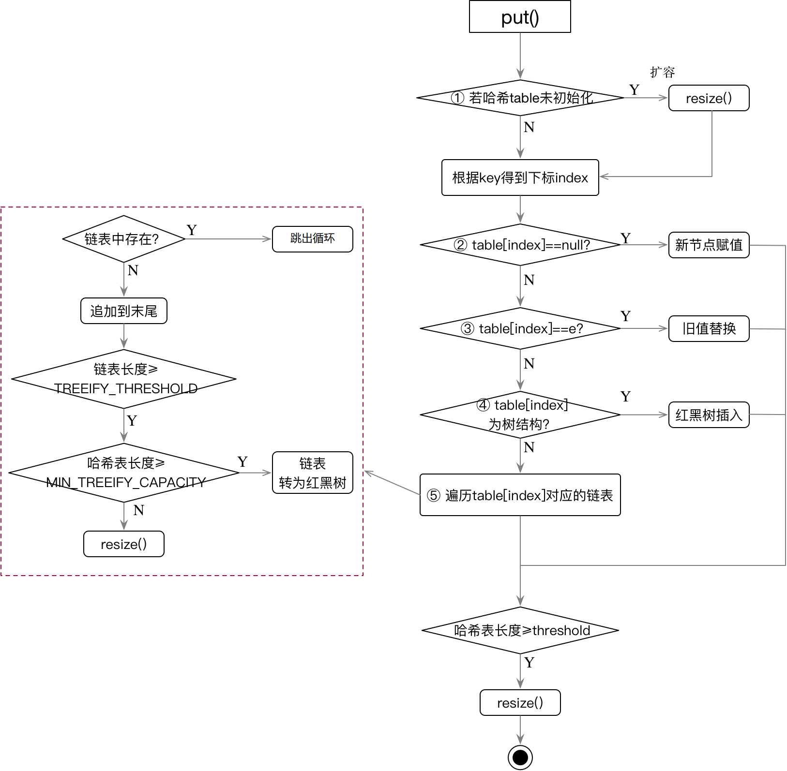

面试题
===

Java SE
===

面向对象的特性
---

面向对象有三大特性：封装、继承、多态。

- **封装**：明确表示允许外部允许访问的方法和属性，外部调用时无需关心内部的实现细节。

- **继承**：子类共有的特征可以提取到父类中，然后子类继承父类，并根据自身的需求进行扩展。

- **多态**：

  前提：继承、方法重写、父类引用指向子类对象。

  ```java
  父类 a = new 子类();
  /* 这个方法必须是父子类都有的方法 */
  a.方法();
  ```

  口诀：**编译看左边，运行看右边**。即编译的时候是父类类型，运行的时候是子类类型。


==和equals
---

==：简单类型则比较值，引用类型比较的是地址。

equals：默认情况下跟==一样，通常会进行重写。

> 比如String类就对equals进行了重写，判断两个字符串内容是否相等。


为什么重写equals还要重写hashcode？
---

object的equals默认是比较内存地址（跟双等号一样），而**hashcode默认是内存地址的哈希值**，如果equals重写了，他为true时两个对象的内存地址并不一定相同，这个时候，如果不重写hashcode，那么他会默认用object的hashcode方法，所以他们的hashcode值是不一样的。就导致两个对象equals相等但是hashcode不相等，这个对象应用在hashmap作为key时他们是先判断hashcode是否相等再比较equals，不相等就为不同的key，所以这样的对象不能应用在map和set里作为key。


final用法
---

final修饰的类不能被继承。

final修饰的方法不能被重写。

final修饰的属性不能被修改；如果是引用类型，则指向不能变，但指向的内容可以改变。


重写跟重载的区别
---

**重载**：发生在同一个类中，方法名必须相同，参数类型、个数、顺序可以不同。如果仅仅是返回值或修饰符不同的话编译器会报错。

**重写**：发生在父子类中，方法名、参数列表必须相同。如果父类方法用private修饰则不能重写。

> 父类的静态方法子类不能重写，如果子类含有跟父类相同的静态方法时，我们称之为**隐藏**。


String、StringBuffer跟StringBuilder
---

**String**是final修饰的，每次操作都会产生新String对象。如果需要不产生新对象则需要使用反射技术进行修改。

StringBuffer跟StringBuilder都是在原对象上进行操作。StringBuffer使用synchronized修饰，是线程安全的；StringBuilder是非线程安全的。

> 性能：StringBuilder > StringBuffer > String


对于CPU来说，数组对于链表的优势
---

CPU读取内存的时候会根据**空间局部性原理**，把一片连续的内存读取出来，然后放到缓存中。又因为数组所占用的空间是连续的，所以访问数组的时候会把数组的全部或部分元素放到缓存中，这样访问数组的速度就会很快。

> 数组优先是行存储，因为CPU会把一行或多行的数据放到缓存中。


Object跟泛型的区别
---

1. 泛型不需要做强制类型转换
2. 泛型编译时更安全。如果使用Object的话，无法保证返回的类型一定是想要的类型。


排序算法
---

> 稳定性指的是两个数的相对位置没有发生改变。比如A在B前面，排序完后A还是在B前面

稳定排序：

- 冒泡排序，O(n*n)
- 插入排序，O(n*n)
- 归并排序，O(nlgn)，需要两倍的空间
- 桶排序，O(n)，所需空间较大

不稳定排序：

- 选择排序，O(n*n)
- 快速排序，O(nlgn)
- 希尔排序，O(n*n)
- 堆排序，O(nlgn)


CAS
---

CAS（Compare and Swap），是一个乐观锁，可以在不加锁的情况下实现多线程之间的变量同步。

其涉及到三个操作数：

1. 需要读写的内存值（当前值 或 版本号）
2. 要进行比较的值（旧值 或 版本号）
3. 写入的新值，当且仅当前面两个数相等时才把新值更新到内存值，否则重复进行比较，直到相等。


### ABA问题

CAS会导致一个ABA问题：即一个线程要把一个变量的值由A改成B，在这个时候另一个线程将这个变量的值由A改成了C然后又改回A（A->C->A），接着第一个线程在CAS时发现变量值仍然是A，所以CAS成功，但实际上是不同的。

如何解决？

添加版本号或时间戳来标记变量，比较的时候比较 值 跟 版本号/时间戳。在java中，可以使用AtomicStampedReference来使用时间戳标记变量。

```java
asr.compareAndSet(100, 101);
```


Error和Exception的区别
---

Error指的是程序无法解决的错误，比如内存不足**OutOfMemoryError** 

Exception通常指的是代码逻辑的异常，比如下标越界**OutOfIndexException** 


hashmap
---

### 重要属性

**size**：元素个数

**threshold**：扩容阈值，默认是0.75f。==太大会容易造成hash冲突，太小空间利用率低==。

**TREEIFY_THRESHOLD**：树化的链表长度的阈值，默认值8，根据泊松分布得到。

**MIN_TREEIFY_CAPACITY**：树化的数组的容量的阈值，默认是64

**DEFAULT_INITIAL_CAPACITY**：数组默认的初始化长度，值为16

**Node<K,V>[] table**：存放元素的数组，长度一定是$2^n$ 


### put操作

put流程图：



如何得到下标：`(n - 1) & hash` （hash为key的hash值，& 等价于取模操作%）

如何计算key的hash值：`return (key == null) ? 0 : (h = key.hashCode()) ^ (h >>> 16)` 

为什么要n-1然后做&操作：因为数组长度是$2^n$ 一定是个偶数，减去1就是奇数，奇数用二进制表示时，**最低的几位都是连续的1，可以更快的取模以及减少hash冲突**。

如何判断元素是否相等：（**先判断hash再使用 ==或equals**）

```java
if (e.hash == hash &&
    ((k = e.key) == key || (key != null && key.equals(k))))
```

> 需要注意，只有数组中的元素重复时才会发送替换，其他情况直接break跳出循环。


### 扩容操作

创建一个新的数组，其**容量为旧数组的两倍 `oldCap << 1`**，并重新计算旧数组中每个结点的存储位置。结点在新数组中的位置只有两种：**原下标** 或 **原下标+旧数组长度**。

因为数组长度变为原来的2倍，在二进制上就是**最高位左移了一位**。所以可以根据最高位来判断元素位置；==是0则下标不变，是1则下标变为原下标+旧数组长度==。

因此，在扩容时，只需要判断最高位是1还是0就好了，这样可以大大提高扩容的速度。

如下：

```java
do {
    next = e.next;
    // oldCap -> 10..0 
    if ((e.hash & oldCap) == 0) {
        if (loTail == null)
            loHead = e;
        else
            loTail.next = e;
        loTail = e;
    }
    else {
        if (hiTail == null)
            hiHead = e;
        else
            hiTail.next = e;
        hiTail = e;
    }
} while ((e = next) != null);
```

因为oldCap的最高位是1，后面全是0，跟原hash值做与操作时，只需看最高位的结果即可。

***

实际扩容操作：先查看数组中的元素后面有没有节点，如果没有，则直接采用`e.hash & (newCap - 1)` 方式确定下标。如果有，那么就遍历这个链表然后根据`e.hash & oldCap` 来确定链表上节点的位置，要么在原位置要么在原下标+旧数组长度的位置。


### 1.7和1.8的区别

**初始化时机**：

1.7：new的时候就初始化数组大小

1.8：put的时候才检查数组是否为null，是的话才初始化数组

***

**扩容条件**：

1.7：必须满足元素个数大于等于阈值且新插入的元素发送了hash冲突

1.8：第一种情况，存完新值之后，判断元素个数是否大于阈值。第二种情况，链表长度大于8但是数组长度小于64。第三种：table为null，即一开始put的时候。

***

**底层结构**：

1.7：只有数组加链表

1.8：数组+链表或红黑树。在链表个数大于8且数组长度大于64的时候链表进化成红黑树，在链表小于6时，红黑树退化成链表。


ConcurrentHashMap
---

> 这里介绍的ConcurrentHashMap是**1.8**以后的。

### 存储结构

跟HashMap一样。只不过ConcurrentHashMap支持并发扩容，其内部通过加锁（**CAS + synchronized**）来保证线程安全。


### 重要属性

**`private static final int DEFAULT_CAPACITY = 16;`** 默认的数组大小，不可修改

***

**`private static final float LOAD_FACTOR = 0.75f;`** 负载因子，决定扩容阈值

HashMap 的负载因子可以修改，但是 ConcurrentHashMap 不可以，因为它的负载因子使用 `final`关键字修饰，值是固定的 *0.75* ：

***

**`private static final long SIZECTL;`** 

`sizeCtr` 即 Size Control，不同的值代表不同的含义：

- `sizeCtl == -1`：表示ConcurrentHashMap正处于**初始化**状态
- `sizeCtl == -n`：表示ConcurrentHashMap正处于**扩容**状态，有n-1个线程帮忙扩容。
- `sizeCtl 为正数`：表示ConcurrentHashMap是正常状态，此时sizeCtl为**扩容的阈值**。

***

```java
static final int TREEIFY_THRESHOLD = 8;
static final int MIN_TREEIFY_CAPACITY = 64;
```

树化的最小条件，链表大于8并且数组长度大于64。


### Node 节点的 hash 值有几种情况？

如果 `Node.hash = -1`，表示当前节点是 **FWD(ForWardingNode) **节点，即**正在扩容**。扩容时会把头节点的hash值置为-1。

如果 `Node.hash = -2`，表示当前节点为 树的根。

如果 `Node.hash > 0`，表示当前节点是正常的 Node 节点。


### ConcurrentHashMap中的hash寻址算法

`(h ^ (h >>> 16)) & HASH_BITS;` hash值 与 hash值的无符号右移16位 异或，再 与上 HASH_BITS (0x7fffffff: 二进制为31个1)

> 为什么与上HASH_BITS？为了让得到的hash值的结果始终是一个正数


### 初始化

首先采用CAS方式将sizeCtr置为 -1，此时其他线程进入就会调用`Thread.yield();` 释放CPU。

然后进行创建数组、设置阈值等操作。初始化完成之后会将sizeCtr变成阈值。


### 插入元素

当进行 put 操作时，流程大概可以分如下几个步骤：

1. 计算key的hash值
2. 接着进入循环，首先判断数组是否为空，如果为空就**初始化数组**；

2. 否则根据key计算下标，判断是否发生hash冲突，若没有冲突采用 **CAS 方式**放入元素；

3. 否则继续判断 `数组元素的hash == -1`是否成立。如果成立，说明当前ConcurrentHashMap正在扩容，此时当前线程帮忙进行扩容操作；
4. 以上都不符合则进入**synchronized代码块**（锁的是数组中的元素），然后把新的Node节点插入到链表或红黑树中；如果插入过程中有相同元素则直接返回。
5. 节点插入完成之后，会判断链表长度是否超过8，如果超过8个，则会进行数组扩容，当数组容量大于64，且链表长度大于8时，链表**进化成红黑树**；
6. 最后，增加元素个数判断**是否要扩容**；


ThreadLocal
---

ThreadLocal类用来设置线程私有变量，**同一线程内可以共享变量，多个线程之间相互隔离**，互不影响。

相当于每个线程内部都有一份对这些变量的拷贝，各个线程只可以操作本线程的ThreadLocal中的变量。典型的以空间换时间。


### 储存结构

每个Thread中有一个ThreadLocalMap类型的属性，叫threadLocals。ThreadLocalMap是ThreadLocal的内部类。

ThreadLocalMap使用Entry数组来存放元素，Entry是一个个的键值对，key为ThreadLocal对象，value为要保存的值。


> Entry的默认初始大小为16，扩容阈值为数组长度的0.75


### 初始化方法

ThreadLocal类的初始化方法是个空方法，只有等第一次set/get的时候才会初始化。

初始化过程是调用ThreadLocalMap的构造方法 `new ThreadLocalMap(本线程, Value);`

1. 创建Entry数组
2. 用**ThreadLocal对象**的下个hash值 跟 数组长度-1 做**与**操作，对应到数组下标，然后放入元素。
3. 设置阈值


### set方法

**ThreadLocal类**的set方法首先会拿出**当前线程的ThreadLocalMap**，然后判断是否需要初始化，不需要的话则调用ThreadLocalMap的set方法设置元素。

ThreadLocalMap的set方法：

1. ThreadLocal对象的下个hash值 跟 数组长度-1 做**与**操作，对应到数组下标

2. 如果发送hash冲突，则使用**开放地址法**，下标往后移一位，如果后一位也有元素，则继续后移，直到数组的末尾，若都发现hash冲突，则下标会从0开始继续试探。一直重复，直到有空的位置后插入。（可以把数组看出循环数组）

   - 如果数组中存在该key，则直接替换。
   - 如果数组中存在key为null的元素，则直接替换。

3. 添加完元素后，如果达到阈值就扩容。

遍历过程如下：


### get方法

ThreadLocal类的get方法第一步也是获取ThreadLocalMap属性，如果为null则初始化，然后以ThreadLocal对象为key，value为null，放在数组上。

否则就调用ThreadLocalMap的getEntry方法，根据key获取下标元素，然后判断该下标的元素的key等不等于要获取的key，如果等于直接返回。否则往后一直遍历，遍历过程中会将key为null的value置为null。如果在遍历的过程中遇到空的entry则说明无此元素，返回null


### 内存泄露

ThreadLocalMap的Entry中，**key是弱引用**，因为ThreadLocalMap容易造成内存泄露。即ThreadLocal对象被置为null，但value还是存在的，虽然key的空间被回收了，但value一直被强引用引用着。

虽然ThreadLocalMap在每个方法中都会检测key为null，然后把value也变成null，但是还有会有检漏情况出现。

**避免内存泄露**的办法只有一种，就是手动调用ThreadLocalMap的**remove方法**，将整个entry删掉。

**remove方法解决内存泄露的原理就是把key跟value都变成null**。

> 为什么要把key变成弱引用?
>
> key为null时才可回收key空间，不然连key空间都不会回收。


Java Web
===

请你说说，cookie 和 session 的区别？
---

1. 存放位置不同。cookie数据存放在客户的浏览器上，session数据放在服务器上。
2. 数据大小不同。单个cookie保存的数据不能超过4K，而session没有限制。
3. 数据类型不同。cookie中只能保管ASCII字符串。而session中能够存储任何类型的数据。
4. cookie对客户端是可见的，用户可以通过设置cookie来进行伪装，但session不行。
5. 服务器资源。cookie保管在客户端，不占用服务器资源。session是保管在服务器端的，每个用户都会产生一个session。假如并发访问的用户很多，会产生很多的session，耗费大量的内存。


如果用户将浏览器的cookie禁用,session还能使用吗?为什么?
---

不能使用. 因为session是使用sessionid进行身份认证的，而cookie存储着sessionid。


计算机组成原理
===

ieee754
---

在计算机中，通常采用ieee754来存储浮点数，存储格式如下：


公式为：**$m_s$M × $2^{E}$** , 【注意】M其实是1.M，因为第一位肯定是1，所以省略。

- `移码 = 真值 + 偏置值` 


- [x] 为什么要使用移码表示阶码？将阶码都变成正数，可以方便浮点数在进行加减运算时的对阶操作。


### 为什么浮点数精度会丢失？

因为计算机表示浮点数时，尾数部分决定了浮点数的精度，而**尾数部分的位数是固定的**，超出了位数的值会按某种规定舍去，所以会出现**精度丢失或溢出**的问题。


场景题
===

从大数据量的找出出现次数最多的，或者前多少大/小的
---

**问题**：

1. 假设有1kw个身份证号，以及他们对应的数据。身份证号可能重复，要求找出出现次数最多的前100个身份证号。
2. 怎么在海量数据中找出重复次数最多的一个
3. 有一个1G大小的一个文件，里面每一行是一个词，词的大小不超过16字节，内存限制大小是1M。返回频数最高的100个词。

**解题思路**：都是采用分支然后归并的方法。

1. 对数据取hash值然后除以一个数n取模，然后将数据分到n个小文件中
2. 对于每个小文件，可以把 数据 作为key，出现次数作为value 存入 hashMap中。
3. 分别对这些小文件进行处理，如排序，取出次数最多的
4. 合并所有的小文件，得出结果

***

比如第一题

1. hash(身份证号)%1000，将身份证号存储到1000个小文件中，每个小文件就只有1w条的数据
2. 对于每个小文件，把身份证作为key，出现次数作为value存入hashMap中。
3. 然后读取每个文件hashMap的次数最多的前100个身份证号使用归并排序存入到一个文件中。
4. 然后读取每个文件出现次数最多的前100个身份证。


JWT生成token有几个部分
---

JWT是 JSON Web Token的缩写，是一种安全的规范，使用JWT可以让我们在用户端和服务端建立一种可靠的通信保障。

JWT有三个部分组成：

1. **header**：描述JWT的元数据，定义了生成签名的算法以及token的类型
   - 这里指定为RSA256非对称加密算法，类型默认是jwt
2. **payload**：负载，用来存放要传递的数据，比如用户的基本信息和token过期时间
3. **signature**：签名，使用 密钥和指定的算法 对header和payload进行签名。

token验证流程：

1. 用户登录时后端返回一个token，前端将其保存在sessionstroage中
2. 前端每次请求中携带token字段，该字段中携带token信息
3. 后端拦截器拦截请求后验证token字段
   - 公钥对签名解密，解密出来的header和payload的信息是否和传过来的一致。


IP地址转为uint64存储与解析
---

### 数据库存储IP地址

当Mysql存储`IPv4`地址时，应该使用32位的无符号整数（`UNSIGNED INT`）来存储`IP`地址，而不是使用字符串。

通常，在保存`IPv4`地址时，一个`IPv4`最小需要7个字符，最大需要15个字符，所以，使用`VARCHAR(15)`即可。`MySQL`在保存变长的字符串时，还需要额外的一个字节来保存此字符串的长度。而如果使用无符号整数来存储，只需要4个字节即可。

相对字符串存储，使用无符号整数来存储有如下的好处：

- **节省空间**，不管是数据存储空间，还是索引存储空间
- 便于使用**范围查询**（`BETWEEN...AND`），且效率更高

使用无符号整数来存储也有缺点：

- 不便于阅读
- 需要手动转换

但对于转换来说，MySQL提供了相应的函数来把字符串格式的IPv4转换成整数`INET_ATON`，以及把整数格式的IP转换成字符串的`INET_NTOA`。如下所示：

```sql
mysql> select inet_aton('192.168.0.1') as ip;
+-------------------------+
| ip                                   |
+-------------------------+
|  3232235521                 |
+-------------------------+
1 row in set (0.00 sec)

mysql> select inet_ntoa(3232235521) as ip; 
+------------------------+
| ip                                 |
+------------------------+
| 192.168.0.1                  |
+------------------------+
1 row in set (0.00 sec)
```


### java层面转换IP地址

```java
public class IpLongUtils {
    /**
     * 把字符串IP转换成long
     *
     * @param ipStr 字符串IP
     * @return IP对应的long值
     */
    public static long ip2Long(String ipStr) {
        String[] ip = ipStr.split("\\.");
        return (Long.valueOf(ip[0]) << 24) + (Long.valueOf(ip[1]) << 16)
                + (Long.valueOf(ip[2]) << 8) + Long.valueOf(ip[3]);
    }

    /**
     * 把IP的long值转换成字符串
     *
     * @param ipLong IP的long值
     * @return long值对应的字符串
     */
    public static String long2Ip(long ipLong) {
        StringBuilder ip = new StringBuilder();
        ip.append(ipLong >>> 24).append(".");
        // 每次取最低的8位
        ip.append((ipLong >>> 16) & 0xFF).append(".");
        ip.append((ipLong >>> 8) & 0xFF).append(".");
        ip.append(ipLong & 0xFF);
        return ip.toString();
    }

    public static void main(String[] args) {
        System.out.println(ip2Long("192.168.0.1"));  // 3232235521
        System.out.println(long2Ip(3232235521L));  // 192.168.0.1
        System.out.println(ip2Long("10.0.0.1"));  // 167772161
    }
}
```


单点登录协议
===

单点登录（SSO）协议有：CAS、OAuth2.0；

> 在大项目中通常会把认证跟资源分开，即有 认证服务器 和 资源服务器。


CAS
---

CAS 全称 `Central Authentication Service`，是一种常见的B/S架构的SSO协议，用户仅需登陆一次，访问其他应用则无需再次登陆。**该协议偏向于认证**。

CAS的认证流程通过包括三部分参与者:

- **Client**: 通常为使用浏览器的用户
- **CAS Client**: 资源服务器（可以多个）
- **CAS Server**: 认证服务器（只有一个）

认证流程如下：

1. 用户向CAS Client发起资源访问，如果用户还未登录，则CAS Client会把请求重定向到CAS Server，CAS Server返回登录界面
2. 用户输入账号密码之后发送给CAS Server，CAS Server验证用户信息，如果通过则向用户返回一个**Service Ticket**。
3. 此后用户每次访问CAS Client都携带着Service Ticket
4. CAS Client收到Service Ticket后，去CAS Server认证该Service Ticket是否有效，有效就返回资源。


OAuth
---

> CAS协议通常是指 同个平台中的不同应用之间的身份认证。
>
> 而OAuth协议是 一个平台的某个应用去授权访问给第三方应用的用户信息。

OAuth, 通常是指OAuth 2.0协议，**OAuth 2.0解决的主要场景是: 第三方应用如何被授权访问资源服务器**。

整个流程参与者包括四个组成部分:（比如利用微信登录牛客）

- **Resource Owner**: 资源拥有者，通常为终端用户
- **Resource Server**: 资源提供者，在这里为 牛客
- **Authorization Server**: 授权服务器，验证用户信息。在这里为微信的授权服务器
- **Client**: 第三方应用，也叫客户端。在这里为 微信

认证流程如下：

1. 用户利用client第三方应用进行登录，Authorization Server返回登录页面。
2. 用户登录第三方应用之后，Authorization Server会返回 access_token给Resource Server
3. Resource Server拿着 access_token访问第三方应用，第三方验证access_token之后返回该用户信息
4. Resource Server展示用户信息


