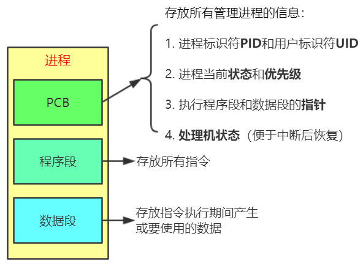
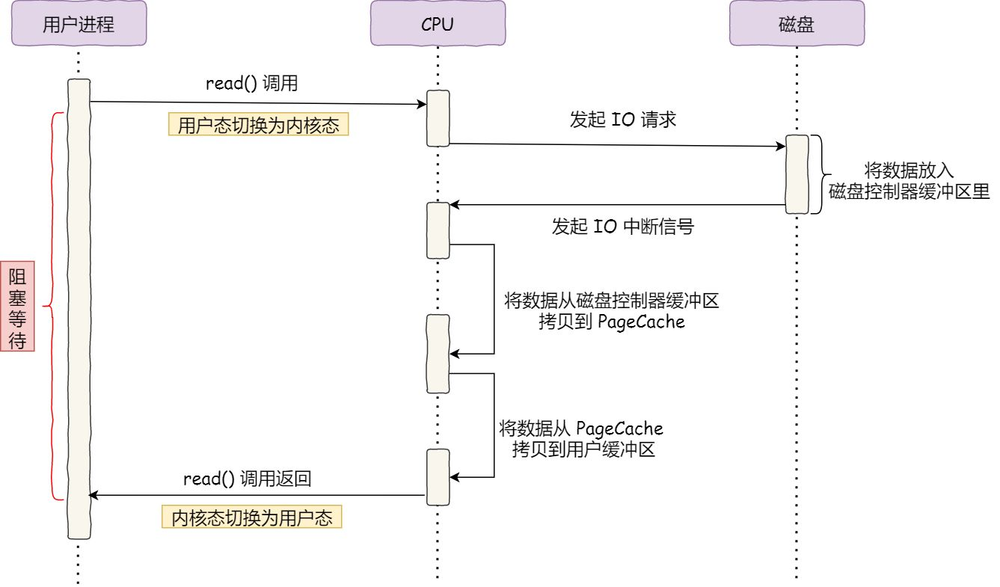

操作系统
===

什么是操作系统
---

操作系统是一个运行在计算机上的**软件程序** ，管理着计算机硬件和软件资源，并且可以对资源合理的进行调度和分配。

操作系统主要完成的功能：进程管理、内存管理、文件管理、设备管理

### 操作系统的特性

- 并发：在一段时间内，宏观上有多个程序同时运行
- 共享：系统中的资源可以被多个程序访问。包括 互斥访问 和 同时访问。
- 虚拟：通过某种技术把一个物理实体变为若干个逻辑上的对应物。
- 异步：进程运行的顺序是无法预知的。

### 用户态和核心态

在计算机系统中，分两种程序：系统程序和应用程序。**为了保证 系统程序 不被 应用程序 有意或无意地破坏**，计算机设置了两种状态—— **用户态、核心态**。

- **用户态**：只能受限的访问内存 ，只能执行非特权指令，运行所有的应用程序。
- **核心态**：可以访问所有数据，可以运行特权指令和非特权指令，运行系统程序。

> 使用 ==程序状态字寄存器==（PSW）中的某个标志位来标识当前CPU的状态。如0是用户态，1是核心态。
>
> 用户态 必须使用**中断**才可以切换到 核心态，然后修改PSW的标记位。
>
> 核心态 切换到用户态则可以直接修改PSW的标记位。

进程管理
---

### 什么是进程

进程由 PCB(进程控制块)、程序段、数据段组成。

### 进程的五种状态

### 进程间通信

- **管道**：管道就是一份文件，进程A往管道中写完数据后，进程B才可以读数据。每个通道都是**半双工通信**，进程A不能既往管道写数据又往该管道读数据。
  - 管道又分为**匿名管道**和**命名管道**，匿名管道只能用于有**亲缘关系**的进程间通信，而命名管道则是用于**任意**进程。
- **消息队列**：是一个链表，一个进程可以往另一个进程的消息队列里发送数据。
- **共享内存**：多个进程可以 **互斥的访问** 共享内存中的数据。（全双工）

### 进程调度策略

**先来先服务 FCFS**：每次都将CPU分配给最先进入到就绪队列的进程。

**短作业优先 SJF**：优先给 **估计运行时间最短**的进程分配CPU。

**优先权调度**：每个进程都关联一个优先级，内核将CPU分配给最高优先级的进程。具有相同优先级的进程，按照先来先服务的原则进行调度。

**时间片调度**：系统将所有的就绪进程按 先来先服务 的原则排成一个队列，每次调度时CPU只执行一个时间片，当前时间片执行完之后就调度下一个进程。

**响应比优先调度**：

- 如果作业的等待时间相同，则服务的时间愈短，其优先权愈高。
- 如果服务的时间相同，等待时间愈长，其优先权愈高。
- 对于长作业，作业的优先级可以随等待时间的增加而提高

### 线程调度策略

- **抢占式调度**：每条线程执行的时间、线程的切换都由**系统控制**。系统控制指的是在系统某种运行机制下，每条线程分的执行时间片长度是不尽相同的。在这种机制下，一个线程的堵塞不会导致整个进程堵塞。
- **协同式调度 **：某一线程执行完后主动通知系统切换到另一线程上执行，这种模式就像接力赛一样，一个人跑完自己的路程就把接力棒交接给下一个人，下个人继续往下跑。`线程的执行时间由线程本身控制`，线程切换可以预知，不存在多线程同步问题，但它有一个致命弱点：如果一个线程编写有问题，运行到一半就一直堵塞，那么可能导致整个系统崩溃。

> JVM采用抢占式调度模型
>
> 单核CPU仍然要考虑线程安全问题，因为**因为单核cpu仍然存在线程切换，执行非原子操作的时候**。

### 进程和线程的区别是什么

1. 进程是资源分配的最小单位，线程是资源调度的最小单位
2. 一个进程至少有一个线程，多个线程可共享进程所拥有的资源，线程必须存活在进程中。
3. 进程之间的切换比线程之间切换的开销要大。 

### 什么情况下会发生死锁？如何解决

死锁：两个或两个以上的进程（线程）在执行过程中，因为争夺资源而造成相互等待状态，若无外力作用，它们都将永远无法执行下去。

形成死锁的四个必要条件：

- **互斥**：一个资源一次只能被一个进程访问。

- **请求与保持**：一个进程因请求资源而阻塞时，对已获得的资源保持不放。

- **不可剥夺**：进程已经获得的资源，在未使用完之前不能强行剥夺。

- **循环等待**：若干资源形成一种头尾相接的循环等待资源关系。

**解决**死锁的办法：

|  死锁条件  |                    解决方案                    |
| :--------: | :--------------------------------------------: |
|    互斥    |                    无法解决                    |
| 请求与保持 |              一次性申请所有的资源              |
|  不可剥夺  | 申请不到资源时，主动释放占有的资源（超时机制） |
|  环路等待  |            顺序执行（注意加锁顺序）            |

内存管理
---

### 什么是内存

**所有数据要放在内存中才可以被CPU使用**。整个内存由一块块连续的 **存储单元** 组成。

不同计算机的存储单元的大小不同，如果计算机**按字节编址**，则一个存储单元为1B（8bit）。如果计算机**按字长编址**，则一个存储单元为一个字（字长由计算机决定）。

> 比如字长为16位的计算机“按字编址”，则每个存储单元大小为1个字，每个字的大小为16bit。

### 从写程序到程序运行

编辑 -- 编译 -- 链接 -- 载入。

- 编译：将程序翻译成机器语言。
- 链接：将每部分的机器语言都链接在一起，形成一个整体的模块。
- 载入：将整体模块载入到内存中

因为机器语言里面所使用的地址是**逻辑地址**（相对地址），所以需要在载入或载入之前将逻辑地址变成内存中的物理地址，也叫绝对地址（ **初始地址+逻辑地址=物理地址** ）。

载入有三种方式：

1. 绝对载入：编译时就将逻辑地址转为物理地址，装入的时候直接装入即可。
2. 静态重定位：装入时就完成逻辑地址到物理地址转换。
3. 动态重定位：利用**重定位寄存器**记录起始地址，程序运行时再动态的转换地址。

### 内存保护

为了保证进程不发生越界访问，操作系统会对每个进程区域进行存储保护：利用**重定位寄存器**和**界地址寄存器**来判断指令是否发生了地址越界。

> 界地址寄存器：存放 进程内存末端地址 的偏移量。

### 内存分配

传统内存分配方式有两种：连续分配和离散分配。

> 内存中分有 系统区 和 用户区。**每个进程的空间分配到用户区**。

**单一连续分配**：用户区只能分配给一个进程。

**固定分区连续分配**：将用户区分成多个大小固定的区域（大小可相同可不同），每个进程分配到每个区域中。

**动态分区连续分配**：进程需要用到内存时才动态的创建分区。至于如何创建在哪创建需要根据动态分配算法来决定。

- ==首次适应==：空闲分区以**地址递增**的次序排列，每次分配空间时，按顺序查找，放得下就立刻分配，然后更新空闲分区。
- ==最佳适应==：空闲分区以**容量递增**的次序排列，每次分配空间时，按顺序查找，放得下就立刻分配，然后更新空闲分区。
- ==最坏适应==：空闲分区以**容量递减**的次序排列，每次分配空间时，按顺序查找，放得下就立刻分配，然后更新空闲分区。

【总结】连续分配会产生大量的内部碎片。

### 页式存储

将**内存空间**分为一个个大小相等的**物理块**（比如4KB），每个物理块从0开始编号。

同时将**进程空间**也分为一个个跟**物理块大小相等**的区域，我们叫做**页**，每页从0开始编号。

操作系统以**页**为单位给每个进程分配内存空间，每页都**离散**的分配到物理块中。

**tips**：物理块越大，越容易产生内部碎片。

如何实现地址的转换？

物理地址 = 页面起始地址 + 页内偏移量。

- `页面起始地址 = 块号 * 块大小`，而块号可以根据页号得到。
- `逻辑地址 / 页面大小 = 页号` 
- `逻辑地址 % 页面大小 = 页内偏移量` 

> 为了方便计算，一般页面长度为 $2^n$ ，这样可以用 **低n位** 表示**页内偏移量**，**剩余的高位**表示 **页号**。

如何根据页号得到块号？

操作系统为**每个进程**建立了一个**页表**，每个页表项记录了 页号跟块号 的对应关系，且每个页表项长度都是相等的，连续的存放在**内存**中。

因为页号我们是已知的，所以页表项里只需要存储每个页对应的块号就可以了。当我们拿到页号，通过公式`页表起始地址 + 页号 * 页表项的长度` 得到页表项，因而得到块号。

### 段式存储

程序按照**自身的逻辑**关系将**进程空间**划分为若干个段，每个段都有一个段名（在低级语言中，程序员使用段名来编程）。内存分配时以段为单位，每个段分配在离散的空间中。

分段系统的逻辑地址结构由 **段号（段名）**和 **段内地址（段内偏移量）**所组成。

操作系统为每个进程建立一个段表，放到内存中。每个段表项包括 **段长**跟**段基址**。

> 物理地址 = 基址 + 段内地址。利用段长判断指令是否越界。

***

段式跟页式的区别：

- **目的不同**：分页的目的是为了离散分配；而分段的目的是为了满足用户的需求；

- **大小不同**：页的大小固定且由系统决定；而段的长度不固定，由具体功能决定；

- **地址空间不同**： 页向用户提供的是一维地址空间；段向用户提供二维地址空间(段名和段内地址)；

- **内存碎片**：页式存储的优点是没有外部碎片，但会产生内部碎片（一个页可能填充不满）；而段式存储的优点是没有内碎片，但会产生外碎片；

### 段页式存储

用户程序**先分段**，每个段内部**再分页**。逻辑地址为：段号、段内页号、页内地址。

查找的时候先根据 段号 找到 页号(存放在块号中)，然后根据 页号 找到具体的 块号 。

### 虚拟内存

在操作系统管理下，用户看来比实际内存大得多的内存就是虚拟内存。

有三个特性：多次性、对换性、虚拟性

- **多次性**：无需一次性将作业全部载入内存，将要用到的部分才载入。这有区别于传统分配方式，传统方式都是一次性载入。
- **对换性**：允许作业在运行过程中，将作业进行调入和换出。
- **虚拟性**：从逻辑上扩充了内存的容量，使用户感觉内存容量远大于实际容量。

> 工作方式：
>
> 首先把进程运行所需要的数据加载到内存中。在后续如果需要用到其他数据，则将其加载到内存中，如果此时内存已满，则会使用页面置换算法将某个页或者某些数据移出内存。

实现虚拟存储的方式：

请求分页存储管理 跟 分页存储管理的区别：

- 当访问页面不在内存时，会发生**缺页中断**，由操作系统将所需信息从外存载入内存
- 若空间不足时，操作系统会使用**页面置换算法**将某些页面移出内存。

因为需要记录页面是否调入内存等信息，所以在页表中新增了四个字段：

| 新增字段 | 作用                                                         |
| -------- | :----------------------------------------------------------- |
| 状态位   | 是否调入内存，1表示已在内存                                  |
| 访问字段 | 记录该页最近访问过几次或最近修改的时间，便于页面置换算法实现 |
| 修改位   | 调入内存后是否被修改过，若有修改，则需要重新写回内存         |
| 外存地址 | 页面在外存中的地址                                           |

地址转换过程：

1. 根据页号去**快表**(相当于缓存)中查找，若命中直接返回。

2. 否则，根据页号去**页表**中查找该页的相关信息，若其没有调入内存则发生**缺页中断**，此时缺页的进程阻塞，页面被载入内存后 缺页的进程 会被唤醒。

3. 如果此时内存不足，则会使用**页面置换算法**，移除一个页面。

4. 当一个页面被访问或调入调出的时候，需要**修改对应的页表项**。

   【注意】在页面被调出的时候，需要在快表中删除该页的页表项。

### 页面置换算法

**最佳置换算法 OPT**：每次淘汰将来最久不会使用的页面。（因为无法预知将来页面，所以该方法是无法实现的）

**先进先出置换算法 FIFO**：每次淘汰最先进入内存的页面。（可以利用指针实现，每次去掉头指针指向的页面即可）

**最近最久未使用 LRU**：每次淘汰已在内存中的，最久没使用到的页面。（利用访问字段记录该页最近的访问时间）

**时钟置换算法**：也叫最近未使用算法。将内存中的页面放入一个循环链表，然后利用 访问字段 记录最近是否访问过。若一个页的访问字段为0，说明该页最近没有被使用过，替换该页；否则将该页的访问字段变为0（不会进行替换），然后往下遍历。如果全都是1，那么第二轮扫描的时候肯定会淘汰第一个页面。

**改进时钟置换算法**：跟时钟置换算法差不多，只不过要考虑修改位，即访问位都是0的情况下，==优先选择修改位为0的页面进行置换==（因为不用重新写回内存）。

> **抖动(颠簸)现象**：多个页面被频繁的调入调出。原因是分配给进程的物理块的数量少于需要频繁访问的页面的数量。

磁盘调度算法
---

- **先来先服务**：根据进程请求访问磁盘的先后顺序进行调度
- **最短寻道时间**：每次选择距离当前磁头最近的磁道进行调度
- **扫描算法（电梯算法）**：在磁头**当前移动方向上**选择与当前磁头所在磁道距离最近的请求作为下一次服务的对象。到达最后一个磁道时，会改变磁头方向，然后根据之前的规则进行调度。
- **循环扫描**：类似于电梯算法，只不过每次到达最后一个进程不是改变磁头方向，而是快速回到起始端重复调用。

Linux的交换分区
---

当内存不足时，将暂时用不到的程序放入到交换分区，当内存足够或者需要用到的时候再换回内存。

> 交换分区的最大值不超过物理内存的两倍。

DMA技术
---

在没有 DMA 技术前，I/O 的过程是这样的：

- CPU 发出对应的指令给磁盘控制器，然后返回；
- 磁盘控制器收到指令后，于是就开始准备数据，会把数据放入到磁盘控制器的内部缓冲区中，然后产生一个**中断**；
- CPU 收到中断信号后，停下手头的工作，接着把磁盘控制器的缓冲区的数据一次一个字节地读进自己的寄存器，然后再把寄存器里的数据写入到内存，而在数据传输的期间 CPU 是无法执行其他任务的。

什么是 DMA 技术？简单理解就是，**在进行 I/O 设备和内存的数据传输的时候，数据搬运的工作全部交给 DMA 控制器，而 CPU 不再参与任何与数据搬运相关的事情，这样 CPU 就可以去处理别的事务**。

有了 DMA 技术，也就是**直接内存访问（Direct Memory Access）** 技术之后，就可以去除CPU数据搬运的工作量。

零拷贝
---

零拷贝运用在主机之间发送文件的情况。因为发送文件时，需要将**文件从硬盘拷贝到内核缓冲区**，再从**内核缓冲区拷贝到用户进程的缓冲区**，接着把**文件从用户进程的缓冲区拷贝到socket缓冲区**，接着**socket把文件内容发送给网卡**。

以上步骤中一共发生了4次文件拷贝，并且4次的内核切换。

在发送文件的时候，并不需要把文件内容发送给用户程序（因为不会对文件进行修改），它只需要知道文件发送成功没有。所以零拷贝就是去掉了把文件内容拷贝到用户程序，再从用户程序拷贝到socket中的操作，而是直接将文件拷贝到内核缓冲区，然后从内核缓冲区拷贝到网卡中。

零拷贝只发生了2次文件拷贝，并且2次的内核切换。

> 当传输大文件时，不能使用零拷贝，因为PageCache 可能被大文件占据，而导致「热点」小文件无法利用到 PageCache，并且大文件的缓存命中率不高，这时就需要使用「异步 IO + 直接 IO 」的方式。

